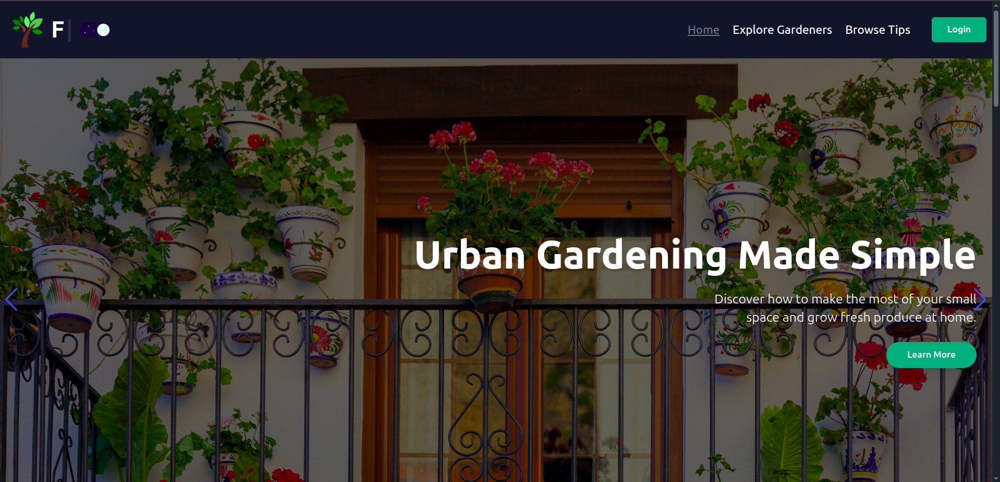

# 🌿 Gardening Community & Resource Hub



---

## 🚀 Project Overview

Welcome to the **Gardening Community & Resource Hub**, a vibrant platform where gardening enthusiasts can share tips, discover local gardeners, ask plant care questions, and join gardening events! Whether you’re into composting, hydroponics, or balcony gardens, this site connects you with like-minded people to grow together.

---

## 🌐 Live Demo

Experience the live site here:  
👉 [Florafy Live](https://assignment-604fb.web.app/)

---

## 💻 Technologies Used

- **Frontend:** React, React Router, Tailwind CSS, React Hook Form, Framer Motion  
- **Backend:** Node.js, Express.js, MongoDB  
- **Authentication:** Firebase Authentication (Email/Password & Google OAuth)  
- **State Management & Data Fetching:** React Query (TanStack Query), Axios  
- **UI Enhancements:** SweetAlert2, React Toastify, React Datepicker  
- **Others:** JWT, dotenv  

---

## ✨ Key Features

- Responsive design for mobile and desktop with smooth UI/UX  
- Secure authentication system with email/password and Google login  
- Dynamic banner slider showcasing upcoming gardening events  
- Featured Gardeners section highlighting active community members  
- Browse, filter, and explore gardening tips sorted by difficulty and popularity  
- Private routes for sharing, managing, and updating garden tips  
- Like button functionality with live updating like counts  
- Dark and Light theme toggle for user preference  
- Robust CRUD operations with toast notifications and confirmation dialogs  
- Custom 404 page and loading spinners for seamless user experience  

---

## 📦 Dependencies

- react  
- react-router-dom  
- react-hook-form  
- @tanstack/react-query  
- axios  
- firebase  
- sweetalert2  
- react-toastify  
- react-datepicker  
- jsonwebtoken  
- express  
- mongoose  
- cors  
- dotenv  

---

## 🛠️ Getting Started Locally

### Prerequisites

- Node.js (v16+)  
- npm or yarn  
- MongoDB Atlas or local MongoDB instance  
- Firebase project with Authentication enabled

### Installation & Setup

1. **Clone the repositories:**

```bash
# Client
git clone https://github.com/codeSmith-006/Florafy-Client.git

# Server
git clone https://github.com/codeSmith-006/Florafy-Server.git
